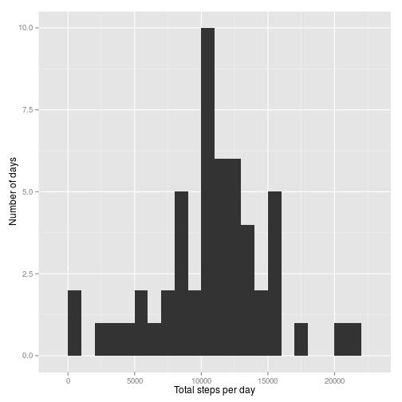
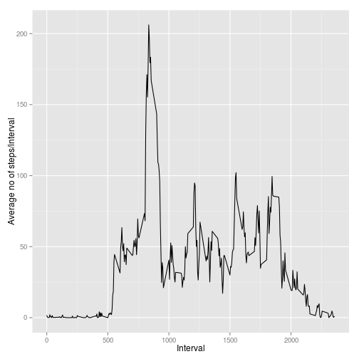
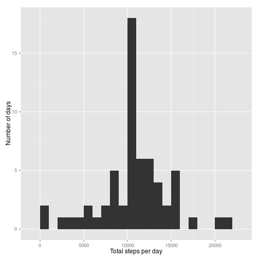
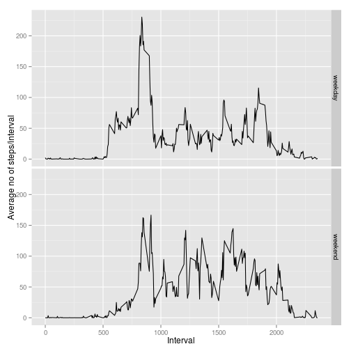

## Loading and preprocessing the data

Unzip and load data, and convert the factor field "date" to calendar dates.


```r
library(ggplot2)
unzip("activity.zip")
activity <- read.csv("activity.csv")
activity$date <- as.Date(as.character(activity$date),"%Y-%m-%d")
```

## What is mean total number of steps taken per day?


```r
# Calculate the total number of steps taken per day
total1 <-tapply(activity$steps,activity$date,sum)
# Calculate the mean and median of the total number of steps taken per day
mean1 <- mean(total1,na.rm=TRUE)
median1 <- median(total1,na.rm=TRUE)
# Make a histogram of the total number of steps taken each day
qplot(total1, geom="histogram",binwidth=1000,xlab="Total steps per day",ylab="Number of days")
```

 

The mean of the total number of steps taken per day is **10766.2**.  
The median of the total number of steps taken per day is **10765**.  

## What is the average daily activity pattern?
In order to keep my code as simple and intelligible as possible, I subjectively decided to not convert the interval numbers to time, and display all the graphs of number of steps as function of the interval numbers. At the same time, when I am going to review other people's work, I will not deduct any points from people who decided to do it the other way.


```r
pattern1 <- aggregate(steps ~ interval, data=activity, mean)
# Find the 5 minute interval that contains the maximum average number of steps
maxinterval <- pattern1$interval[which.max(pattern1$steps)]
# Plot the average daily patterns
qplot(interval,steps,data=pattern1,geom="path",xlab="Interval",ylab="Average no of steps/interval")
```

 

On average, across all the days in the dataset, the 5-minute interval that contains the maximum number of steps is interval number **835**.

## Imputing missing values


```r
# Calculate the total number of missing values in the dataset
missing <- length(which(is.na(activity$steps)))
```
The total number of missing values in the dataset is **2304**. 

While there is some varibility in the average number of steps taken each month, each week, and each day, most of the variability occurs in the average number of steps for each interval in a day. For that reason I subjectively decided to impute the missing values by replacing them with the mean number of steps for an interval, using a method proposed by Hadley Wickham in 2009 at http://www.mail-archive.com/r-help@r-project.org/msg58289.html


```r
# impute missing values
impute.mean <- function(x) replace(x, is.na(x), mean(x, na.rm = TRUE))
activity2 <- plyr::ddply(activity, ~ interval, transform, steps = impute.mean(steps))
# compute total steps/day, and mean and median of that
total2 <-tapply(activity2$steps,activity2$date,sum)
mean2 <- mean(total2)
median2 <- median(total2)
# create histogram
qplot(total2, geom="histogram",binwidth=1000,xlab="Total steps per day",ylab="Number of days")
```

 

The mean of the total number of steps taken per day (NO imputation) = **10766.2**  
The mean of the total number of steps taken per day (WITH imputation) = **10766.2**  

The median of the total number of steps taken per day (NO imputation) = **10765**  
The median of the total number of steps taken per day (WITH imputation) = **10766**  

## Are there differences in activity patterns between weekdays and weekends?
Label each date as weekday or weekend and make a panel plot containing a time series plot of the 5-minute interval and the average number of steps taken, averaged across all weekday days or weekend days.


```r
#Label each date as weekday or weekend
activity2$wday <- as.factor(ifelse(weekdays(activity2$date) %in% c("Saturday","Sunday"), "weekend", "weekday"))
#Plot the average daily patterns for weekdays and weekends
pattern2 <- aggregate(steps ~ interval + wday, data=activity2, mean)
qplot(interval,steps,data=pattern2,facets=wday~.,geom="path",xlab="Interval",ylab="Average no of steps/interval")
```

 
